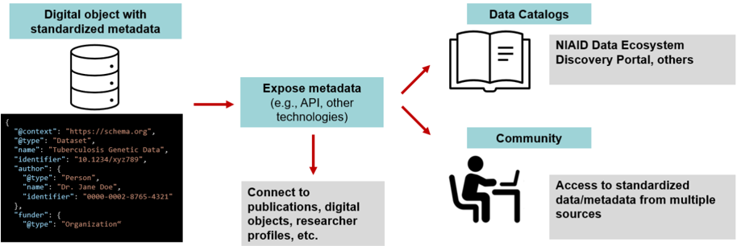
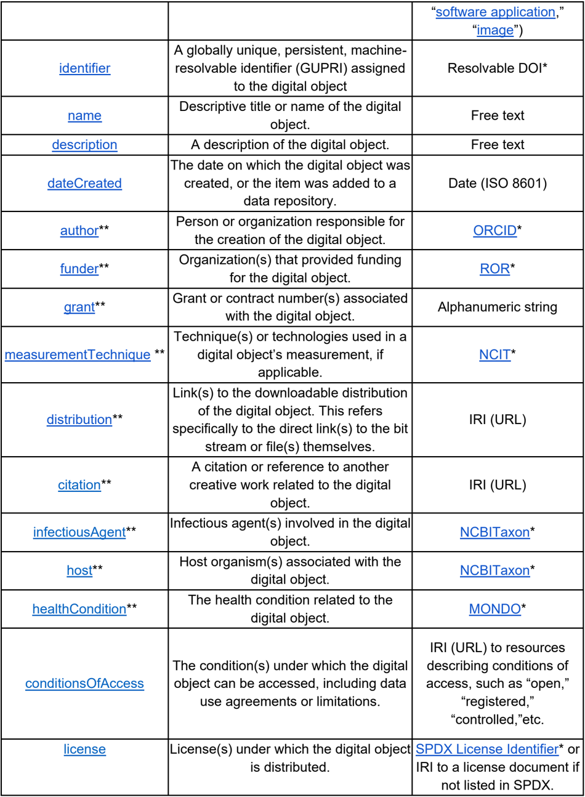
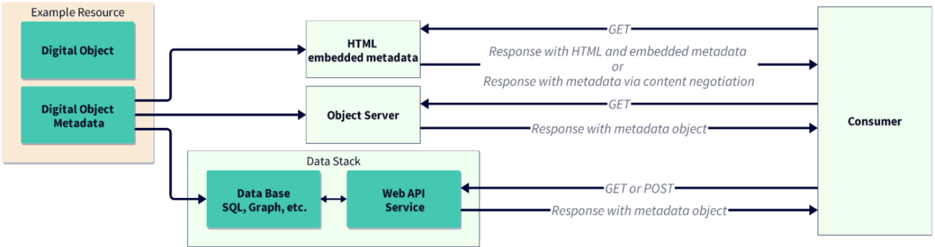

This is a living document and will be continually updated. If you have any questions or concerns, please contact datascience@niaid.nih.gov.

## A Blueprint for Including Digital Objects in the NIAID Data Ecosystem

| Background and Introduction ....................................................................................................2                                                                                      | Background and Introduction ....................................................................................................2                                                                                      |
|------------------------------------------------------------------------------------------------------------------------------------------------------------------------------------------------------------------------|------------------------------------------------------------------------------------------------------------------------------------------------------------------------------------------------------------------------|
| Audience ......................................................................................................................................3                                                                       | Audience ......................................................................................................................................3                                                                       |
| Implementation ...........................................................................................................................4                                                                            | Implementation ...........................................................................................................................4                                                                            |
| 1. NIAID Minimal Metadata Schema ...................................................................................5                                                                                                  |                                                                                                                                                                                                                        |
| 1.1. Motivation .......................................................................................................................5                                                                               | 1.1. Motivation .......................................................................................................................5                                                                               |
| 1.2. Blueprint Requirements ..................................................................................................5                                                                                        |                                                                                                                                                                                                                        |
| 1.3. Impact.............................................................................................................................7                                                                              | 1.3. Impact.............................................................................................................................7                                                                              |
| 2. Persistent Identifiers (PIDs) ...........................................................................................7                                                                                          |                                                                                                                                                                                                                        |
| 2.1. Motivation .......................................................................................................................7                                                                               | 2.1. Motivation .......................................................................................................................7                                                                               |
| 2.2. Blueprint Requirements ..................................................................................................8                                                                                        |                                                                                                                                                                                                                        |
| 2.3. Impact.............................................................................................................................9                                                                              | 2.3. Impact.............................................................................................................................9                                                                              |
| 3. Minimal API Specifications for Exposing Metadata to Machines ...............................9                                                                                                                       | 3. Minimal API Specifications for Exposing Metadata to Machines ...............................9                                                                                                                       |
| 3.1. Motivation .......................................................................................................................9                                                                               |                                                                                                                                                                                                                        |
| 3.2. Blueprint Requirements ..................................................................................................9                                                                                        | 3.2. Blueprint Requirements ..................................................................................................9                                                                                        |
| 3.3. Impact...........................................................................................................................11                                                                               | 3.3. Impact...........................................................................................................................11                                                                               |
| 4. Minimal Citation Requirements ...................................................................................11                                                                                                 | 4. Minimal Citation Requirements ...................................................................................11                                                                                                 |
| 4.1. Motivation .....................................................................................................................11                                                                                | 4.1. Motivation .....................................................................................................................11                                                                                |
| 4.2. Blueprint Requirements ................................................................................................12                                                                                         | 4.2. Blueprint Requirements ................................................................................................12                                                                                         |
| 4.3. Impact...........................................................................................................................13                                                                               | 4.3. Impact...........................................................................................................................13                                                                               |
| 5. Point of Contact for Outreach and Training ...............................................................13                                                                                                        | 5. Point of Contact for Outreach and Training ...............................................................13                                                                                                        |
| 5.1. Motivation .....................................................................................................................13                                                                                | 5.1. Motivation .....................................................................................................................13                                                                                |
| 5.2. Blueprint Requirements ................................................................................................13                                                                                         | 5.2. Blueprint Requirements ................................................................................................13                                                                                         |
| 5.3. Impact...........................................................................................................................14                                                                               | 5.3. Impact...........................................................................................................................14                                                                               |
| Declarations................................................................................................................................14                                                                         | Declarations................................................................................................................................14                                                                         |
| Funding ...................................................................................................................................14                                                                          | Funding ...................................................................................................................................14                                                                          |
| Appendix.....................................................................................................................................15                                                                        | Appendix.....................................................................................................................................15                                                                        |
| Metadata Schemas .................................................................................................................17                                                                                   | Metadata Schemas .................................................................................................................17                                                                                   |
| Examples of Metadata Elements and Entries for NIAID-funded Datasets Indexed in the NIAID Data Ecosystem Discovery Portal ...........................................................................................18 | Examples of Metadata Elements and Entries for NIAID-funded Datasets Indexed in the NIAID Data Ecosystem Discovery Portal ...........................................................................................18 |

| Ontologies ...............................................................................................................................22   |
|------------------------------------------------------------------------------------------------------------------------------------------------|
| Application Programming Interface (API) Reference ..............................................................24                             |

## Background and Introduction

National Institute of Allergies and Infectious Diseases (NIAID)-funded research produces millions of digital objects 1  including data, software, methods, and workflows for the infectious and immune-mediated disease (IID) research community. However, barriers to ensure digital objects are discoverable and reusable persist, reducing their impact. Barriers include variability across data standards, limited findability, missing data access information, a lack of interoperability, incomplete metadata, and a lack of information on (re)use conditions, such as licenses. 2

The Office of Data Science and Emerging Technologies (ODSET) partnered with GO FAIR US (GFU), a group of global data sharing experts, to leverage the Findable, Accessible, Interoperable, and Reusable (FAIR) Principles as a framework to assess and improve the discovery, accessibility, and interoperability of digital objects in NIAID-funded repositories across the NIAID Divisions (Supplemental Table 1). 3  Based on GFU recommendations, ODSET developed the "NIAID Blueprint for Integrating Digital Objects into the NIAID Data Ecosystem' (NIAID Blueprint for Digital Objects or NIAID Blueprint), which includes guidance and specifications for a minimal metadata schema, the use of persistent identifiers (PIDs), minimal Application Programming Interfaces (APIs) specifications, minimal citation practices, and designated points of contact for outreach and training. Implementing the NIAID Blueprint is expected to improve the findability and use of NIAID digital objects and to accelerate the development of countermeasures against infectious and immune-mediated diseases.

Figure 1. Graphic overview of Blueprint elements and potential impact. Digital objects (data, software, methods, and workflows) with standardized metadata can be exposed in a variety of ways (e.g. API) to data catalogues and the community to enable access to standardized data/metadata from multiple sources.



1  A digital object is a sequence of bits representing information, identified by a persistent identifier, and described by metadata, RDA.

2  (Hughes et al., 2023; Musen, 2022; Tsueng et al., 2023)
--image-export-mode
3  (Wilkinson et al., 2016)

The Blueprint serves as a foundational starting point for NIAID data resources, providing a minimal set of specifications. It is not intended to fully meet the unique needs of each repository. Instead, the primary goals of the NIAID Blueprint are to: 1) align NIAID resources under a shared framework; 2) support prospective data capture for data generators and define structured elements that data repository owners should capture from their contributors; and 3) create a flexible framework that integrates with the broader NIAID ecosystem of digital objects, including the NIAID Data Ecosystem Discovery Portal. To achieve these goals, the NIAID Blueprint is organized into five key areas outlined below.

## The NIAID Blueprint for Digital Objects

1. NIAID minimal metadata schema: required use of a minimal set of NIAID-relevant metadata elements and a standard schema with default formats to represent these metadata.
2. Persistent Identifiers: use of persistent identifiers (PIDs) for relevant metadata elements, e.g., for authenticated repository users or data generators (authors).
3. APIs for Metadata: exposure of metadata elements through a standard, open API that complies with minimal specifications.
4. Citation guidance: explicit guidance to the research community on how digital objects should be cited.
5. Outreach and Training: establishment of a point of contact (at major repositories) for desired community outreach and training to benefit the NIAID Data Ecosystem Discovery Portal. 4

## Audience

The NIAID Blueprint for Digital Objects provides a framework to improve interoperability and reuse of digital objects produced by NIAID-funded research. The Blueprint provides guidance for both data generators and data repository owners, enhancing the interoperability and reuse of NIAID-funded digital objects within the broader community. The following sections outline how the Blueprint applies to data generators and repository owners.

## Data generators

The Blueprint outlines the metadata elements and persistent identifiers that researchers should capture during the data collection process. Capturing structured metadata and PIDs is crucial for making data more FAIR across the NIAID ecosystem, supporting attribution, traceability, and reuse. While data generators are not expected to implement APIs, they are encouraged to be aware of repository features such as standardized APIs that facilitate data integration and discovery. Additionally, the Blueprint provides data generators with citation guidelines to ensure proper attribution of their digital objects and make it easier for them to cite resources they have used for their research. The Blueprint also establishes training and outreach opportunities by repository resource owners to support researchers in following these practices.

4  (National Institute of Allergy and Infectious Diseases, 2025)

## Data repository owners

The Blueprint provides guidance to data repository owners, such as repository managers, on implementing consistent metadata practices, assigning persistent identifiers, and exposing metadata through standardized APIs. Owners are responsible for applying the schema within their systems, maintaining a PID infrastructure, and ensuring metadata is captured from data generators and is made accessible via an open API that meets the minimal standards. The Blueprint also includes citation guidance that should be posted publicly to inform data generators of preferred citation practices for each repository. Repositories are also encouraged to offer outreach and training resources to support their contributor communities.

## Implementation

ODSET collaborated with GFU and an initial group of major NIAID-supported data repositories to develop the NIAID Blueprint (Supplementary Table 1). This collaborative process assessed how the Blueprint could be applied across diverse repository contexts. The Blueprint is designed to be adaptable, allowing it to meet the differing  needs, maturity levels, and data types found across repositories.

While the Blueprint prioritizes the separation of metadata and data, it acknowledges that some repositories, like The Immune Epitope Database (IEDB) and ImmuneSpace, do not maintain strict separation in order to enhance usability. To accommodate such variability, the Blueprint provides a minimal set of metadata specifications that repositories can map to, regardless of how they structure their metadata and data. This flexibility ensures that all repositories can align with the shared framework while maintaining their unique operational practices.

Support and implementation by NIAID data generators and repository owners will improve the discovery, use, and interoperability of digital objects across the NIAID ecosystem. NIAID intends to make continuous improvements to the Blueprint to ensure that it evolves with community needs and technological advancements.

In addition to supporting interoperability of digital objects across the NIAID ecosystem, the Blueprint specifications will support integration of resources into the NIAID Data Ecosystem Discovery Portal. The Portal aggregates and enhances metadata from NIAID-relevant data resources to support search across data repositories. To learn more about how to add data to the Portal, visit its documentation on Contributing to the NIAID Data Ecosystem or contact niaiddataecosystem@mail.nih.gov.

## 1. NIAID Minimal Metadata Schema

## 1.1. Motivation

Metadata is essential for providing the context and details of digital objects. For digital objects, with data sharing limitations (e.g., personal health information, large datasets, etc.), corresponding metadata can be exposed to promote findability. This Blueprint defines a minimal set of metadata elements for describing digital objects, which will improve their discovery and use in the NIAID Data Ecosystem Discovery Portal and across the broader research community. The minimal set of metadata is designed as a flexible framework to accommodate the unique needs of each repository, rather than requiring strict adoption of every single specified item. While we encourage the collection of all metadata elements, adopting even a subset will provide meaningful support for alignment and interoperability.

For effective implementation, metadata should be captured by the data repository managers at the time of data submission. Data generators (e.g., researchers) are encouraged to generate and document these metadata elements during the creation or collection of their digital objects. Where appropriate, researchers should share these metadata elements alongside any digital objects shared from their scientific research.

## 1.2. Blueprint Requirements

Table 1 presents the metadata elements, along with default value formats, reflecting a minimum standard for understanding and using digital objects. Representations appropriate for each metadata element, such as PID types, are provided in the last column of the table; see the PIDs section below for more details. The Blueprint does not specify a metadata storage format (e.g., JSON, YML, XML); repositories should select one that best fits their implementation needs.

The metadata elements presented in Table 1 are based on schema.org, a widely adopted framework that defines the relationship between data elements within a domain. While it is the preferred standard, other schemas may also be appropriate if they are interoperable with schema.org, widely used, openly available, and maintained by a community (Supplemental Table 2). The preferred default representation in Table 1 supports alignment across the NIAID ecosystem. These defaults reflect common NIH/NIAID practices and will continue to evolve with community input. Examples of how this metadata is applied can be found in Supplementary Tables 3 and 4.

Table 1. Schema.org-based metadata elements, descriptions, and default formats for infectious and immune-mediated disease digital objects.

| Metadata Element Describing the Digital Object   | Metadata Element Description           | Default Format for Metadata Value   |
|--------------------------------------------------|----------------------------------------|-------------------------------------|
| type                                             | Identifies the type of digital object. | IRI to type (e.g., ' dataset ,'     |



|                         |                                                                                                                                                         | ' software application ,' ' image ')                                                                    |
|-------------------------|---------------------------------------------------------------------------------------------------------------------------------------------------------|---------------------------------------------------------------------------------------------------------|
| identifier              | A globally unique, persistent, machine- resolvable identifier (GUPRI) assigned to the digital object                                                    | Resolvable DOI*                                                                                         |
| name                    | Descriptive title or name of the digital object.                                                                                                        | Free text                                                                                               |
| description             | A description of the digital object.                                                                                                                    | Free text                                                                                               |
| dateCreated             | The date on which the digital object was created, or the item was added to a data repository.                                                           | Date (ISO 8601)                                                                                         |
| author**                | Person or organization responsible for the creation of the digital object.                                                                              | ORCID*                                                                                                  |
| funder**                | Organization(s) that provided funding for the digital object.                                                                                           | ROR*                                                                                                    |
| grant**                 | Grant or contract number(s) associated with the digital object.                                                                                         | Alphanumeric string                                                                                     |
| measurementTechnique ** | Technique(s) or technologies used in a digital object's measurement, if applicable.                                                                     | NCIT*                                                                                                   |
| distribution**          | Link(s) to the downloadable distribution of the digital object. This refers specifically to the direct link(s) to the bit stream or file(s) themselves. | IRI (URL)                                                                                               |
| citation**              | A citation or reference to another creative work related to the digital object.                                                                         | IRI (URL)                                                                                               |
| infectiousAgent**       | Infectious agent(s) involved in the digital object.                                                                                                     | NCBITaxon*                                                                                              |
| host**                  | Host organism(s) associated with the digital object.                                                                                                    | NCBITaxon*                                                                                              |
| healthCondition**       | The health condition related to the digital object.                                                                                                     | MONDO*                                                                                                  |
| conditionsOfAccess      | The condition(s) under which the digital object can be accessed, including data use agreements or limitations.                                          | IRI (URL) to resources describing conditions of access, such as 'open,' 'registered,' 'controlled,'etc. |
| license                 | License(s) under which the digital object is distributed.                                                                                               | SPDX License Identifier* or IRI to a license document if not listed in SPDX.                            |

| spatialCoverage**   | The geographic area covered by the digital object.   | Country Code (ISO 3166) *           |
|---------------------|------------------------------------------------------|-------------------------------------|
| temporalCoverage**  | The time period covered by the digital object.       | Date range (ISO 8601 for start/end) |

Abbreviations : DOI (Digital Object Identifier), ISO (International Organization for Standardization), ORCID (Open Researcher and Contributor ID), ROR (Research Organization Registry), IRI (Internationalized Resource Identifier), NCIT (National Cancer Institute Thesaurus), MONDO (Mondo Disease Ontology), SPDX (Software Package Data Exchange). *Default PIDs and ontologies are provided in the 'Required Element Representation' column, but alternatives may be acceptable in certain circumstances. Refer to Table 2 for PIDs and Supplementary Table 5 for ontologies. **Multiple entries may be used to complete this field (e.g., multiple fields and/or values may be added to the schema to accommodate multiple authors.) Best practices will differ by repository.

## 1.3. Impact

Describing digital objects with standardized metadata enables broader integration into research systems and workflows, promoting efficient discovery, access, and collaboration across platforms. Additionally, consistent metadata supports proper citation and reuse, contributing to the long-term value and credibility of the digital objects. The use of PIDs and ontologies further enhances this integration by ensuring that digital objects are uniquely identified and consistently categorized. Even if repositories do not separate metadata from data, aligning with the minimal set of metadata elements can support integration with other resources. Together, these practices ensure that digital objects remain valuable, accessible, and reusable, ultimately accelerating the advancement of NIAID-supported IID research.

## 2. Persistent Identifiers (PIDs)

## 2.1. Motivation

Metadata populated with PIDs ensures long-term persistence and traceability of digital objects, enabling consistent identification and access across systems, regardless of location or format changes. PIDs help address reproducibility challenges, improve research quality, and support verification, transparency, and open science by linking digital objects to their documentation.

To maximize interoperability, the FAIR Principles call for globally unique and persistent PIDs, meaning they are persistently resolvable identifiers (GUPRIs). DOIs, URLs, and IRIs provide several of these capabilities, and can all be used to identify a wide range of digital objects. All the identifier types in Table 2 are based on URLs or IRIs and are understood to be globally unique and resolvable.

It is important to note that some identifiers, like DOIs, are not resolvable in their basic format. However, by prefixing a DOI with a DOI resolution path, it becomes resolvable. For instance, prefixing '10.1000/182' with ' https://doi.org/ ' creates the resolvable DOI https://doi.org/10.1000/182, which is the recommended format. URLs are commonly used, but without organizational commitment they lack the same level of persistence as a resolvable DOI, which undermines the citation stability and reproducibility that are crucial for scientific research.

## 2.2. Blueprint Requirements

The NIAID Blueprint specifies certain PIDs to represent metadata (Table 1). Metadata elements from Table 1 are mapped to default PIDs, emphasizing how  default requirements improve alignment between repositories. For example, each digital object should be assigned a DOI (default option) which would be populated in the metadata element labeled 'identifier.' Additional metadata fields, such as 'author,' 'funder,' and 'citation,' should be populated with an ORCID, ROR, or IRI, respectively. Using alternative PIDs may be appropriate in certain circumstances.

Many repositories will include an option to generate a DOI, or another PID, when depositing data or other digital objects. If sharing to a repository without this service, researchers can register their digital objects with a DOI registration agency such as Crossref or DataCite.

Several metadata elements can be populated with ontologies, or standard vocabularies. Examples of ontologies in Table 1 include MONDO Disease Ontology to describe healthCondition and NCBITaxon to describe infectiousAgent and host. These are two examples of many ontologies that can be used to populate these metadata fields. Additional descriptions and examples of default and alternative ontologies are found in Supplemental Table 5.

Table 2. Persistent identifiers for metadata elements. The default persistent identifier for the required element representation is highlighted in green; alternative identifiers are listed without shading.

| Metadata Element   | Identifier                                  | Description                                                                                                                                                                                                   |
|--------------------|---------------------------------------------|---------------------------------------------------------------------------------------------------------------------------------------------------------------------------------------------------------------|
| identifier         | Digital Object Identifier (DOI)             | A unique and persistent alphanumeric string assigned to a digital object, such as a research article, dataset, or other scholarly content, to provide a permanent link to its location on the internet.       |
| identifier         | Research Resource Identification (RRID)     | A persistent identification number assigned to key biological resources (e.g., antibodies, model organisms, cells, databases, and research organizations) to help cite resources used in biomedical research. |
| identifier         | Uniform Resource Locator (URL)              |                                                                                                                                                                                                               |
| identifier         | Internationalized Resource Identifier (IRI) | A flexible identifier that supports a wider range of characters, including non-ASCII characters, used to identify any resource, including academic and non-academic resources.                                |

| funder   | Research Organization Registry (ROR)               | Identifiers for research institutions, including universities, research centers, and other scholarly organizations.                               |
|----------|----------------------------------------------------|---------------------------------------------------------------------------------------------------------------------------------------------------|
| author   | Open Researcher and Contributor Identifier (ORCID) | Identifier for researchers and academics.                                                                                                         |
| author   | International Standard Name Identifier (ISNI)      | A unique identifier for public contributors to creative works, including researchers, authors, artists, and other contributors in various fields. |
| author   | Research Organization Registry (ROR)               | Identifiers for research institutions, including universities, research centers, and other scholarly organizations.                               |

## 2.3. Impact

By integrating these metadata fields, along with the ontologies and PIDs that characterize them, the NIAID digital objects not only become more easily discoverable but also significantly more accessible for citation purposes.

## 3. Minimal API Specifications for Exposing Metadata to Machines

## 3.1. Motivation

The NIAID repository landscape includes a variety of data systems supporting metadata access for researchers or their tools. These range from systems with little or no metadata access to those with Application Programming Interfaces (APIs) and other computational tools. Although systems do not need to be the same to work together, aligning NIAID repositories to a common standard will maximize the findability of metadata from all research areas to support data discovery and reuse.

## 3.2. Blueprint Requirements

As with other sections of the Blueprint, API recommendations are designed to be customized during the implementation phase to address the needs of each repository in exposing their metadata for human or machine access. For example, if a repository or data generator is not able to develop an API, they can add HTML with embedded metadata, or a downloadable index of the metadata in a computer-accessible format (Fig. 1). On the other end of the spectrum, repositories with advanced API infrastructure could develop complementary services, such as a queryable metadata knowledge graph.

Any of these options would allow a data provider to share resources in a way that facilitates metadata collection and aggregation. In Figure 2, 'Example Resource' represents one possible resource, which could be a webpage with HTML embedded metadata, an object server delivering a direct byte stream, or a database. The term 'Object Server' refers to the endpoint that delivers the bytes of a digital object or its metadata, rather than the repository where they are stored. The 'HTML embedded metadata' approach means structured metadata (such as JSONLD) is built directly into a webpage describing the resource. In contrast, the 'Object Server' approach delivers the JSON -LD or other metadata as a byte stream directly. These are alternative access methods to the 'Example Resource', not simultaneous connections. In practice, an API may return anywhere from one to many resources, each containing both a data byte stream and its associated metadata byte stream.

Figure 2. Illustration of how metadata can be exposed through an API with various workflows, from the resource to the consumer. The 'Example Resource' could be accessed through different environments (e.g., HTML with embedded metadata, an object server, or a database).



For standardized machine access to metadata, APIs should expose metadata elements described in Table 1. In general, an API should meet these minimum objectives:

- Metadata Encoding: API responses should return metadata encoded in JSON-LD, at least as an option. This would follow the types and properties guidance in the minimal metadata specification above.
- IRI (URL) Structure: API endpoints should be designed as resource-oriented IRIs (e.g., /datasets/{dataset\_id} ), avoiding verbs and complex query parameters in the IRI structure. This ensures that the IRIs can function as persistent identifiers (IRIs) within the JSON-LD @id field, enabling seamless integration into knowledge graphs.
- HTTP Method: Metadata retrieval should be performed using the HTTP GET method, as it allows for easier referencing of resources in the graph data model. However, POST may be used in cases where parameters for the API must be sent in the message body, such as when handling large or complex queries, or when security or data submission requirements make POST preferable
- Documentation: API documentation should adhere to OpenAPI/Swagger specifications for machine-readability and ease of use.

An example of API-exposed metadata formatted to meet these objectives is given in Supplemental Table 7.

## 3.3. Impact

The minimal API specification in the NIAID Blueprint would significantly improve the NIAID data ecosystem as a robust, scalable method for sharing metadata about NIAID digital objects. For example, the API standard would facilitate the creation of metadata catalogs and resource graphs, enhance the NIAID Data Ecosystem Discovery Portal, and enable integration with other cataloging services and data-driven workflows. The result would be a more sustainable, transparent, and user-friendly data architecture, empowering researchers to leverage NIAID data more effectively.

## 4. Minimal Citation Requirements

## 4.1. Motivation

This section highlights the importance of citing digital objects to ensure proper attribution to their creators. Accurate citation also enhances transparency, strengthens provenance, and supports the reproducibility of scientific research. Additionally, citation helps repositories track use of their data, providing usage statistics and supporting verification of appropriate data reuse. This section also offers guidance to repository owners on providing clear citation instructions.

Within the NIAID repository landscape, there is variability in citation practices. Clear and accessible citation guidelines will help users properly credit the resources they use. Additionally, integrating PIDs, such as author ORCIDs, will allow repository owners to track the impact and usage of their digital resources, facilitate linking related objects (e.g., publications and data assets), and streamline measurement of scientific outputs from scientists and programs. While most repositories use local identifiers, more emphasis on incorporating PIDs to reference specific digital objects will support these efforts.

Citation and acknowledgement recommendations should align with the typical usage patterns for a repository. If a typical user pulls data from a small number of discrete digital objects, citations should be associated with each object to ensure clear traceability for the resulting research. If, on the other hand, data is typically accessed in a broad way from a repository as a whole, or via queries that cross many different data assets, citations may be more appropriately associated with the whole repository. In the latter case, repositories should still provide a recommendation for how users should reference the resource, and ideally include PIDs where appropriate. For example, many NIAID repositories have already been assigned Research Resource Identifiers (RRIDs), e.g. ITN Trialshare. Citations to a repository as a whole should always include PIDs like RRIDs or DOIs when they exist.

Finally, it is critical to make recommendations for citations and acknowledgements very easy to find on the web site (e.g., section titled 'How to Cite'), and to include this information in regular communications to users, such as within user workshops or online trainings, community newsletters, documentation pages, and within metadata for individual data assets.

## 4.2. Blueprint Requirements

To enhance the citation process and ensure that digital objects are properly attributed, data repository owners should include the following guidance for data generators:

Integrate PIDs into Citation : Encourage use of PIDs, such as resolvable DOIs, in citations to enhance discoverability and traceability of digital objects (Table 3).

Establish Consistent Citation Guidelines : Provide clear, consistent instructions for citing both original research data and reused data.

- Original data citations should include the repository name, repository PID (e.g., RRID), and data PID, in standardized text suitable for publications.
- Reused data citations should include the object PID (e.g., DOI) and, if applicable, a repository-specific ID (e.g., accession numbers).

Use Standard Formats: Offer citation examples in commonly used formats (e.g., PubMed, NLM, APA, etc.) to ensure they are easy to copy and import into citation tools.

Table 3. Examples of citation styles for digital objects and examples, including a resolvable digital object identifier (DOI).

| Digital Object Type   | Citation Style                           | Citation                                                                         | Example                                                                                                               |
|-----------------------|------------------------------------------|----------------------------------------------------------------------------------|-----------------------------------------------------------------------------------------------------------------------|
| Dataset               | APA (American Psychological Association) | Author(s). (Year). Title of dataset (Version number) [Data set]. Repository. DOI | Smith, John, et al. (2023). Global Health Dataset (Version 1.0) [Data set]. DataHub. https://doi.org/10.1234/abcd1234 |
| Dataset               | MLA (Modern Language Association)        | Author(s). Title of dataset . Version number, Repository, Year, DOI.             | Smith, John, et al. Global Health Dataset . Version 1.0, DataHub, 2023, https://doi.org/10.1234/abcd1234.             |
| Software              | Chicago                                  | Author(s). Title of software . Version number.                                   | Johnson, Emily, et al. PathogenFinder . Version 3.2. BioTools, 2024. https://doi.org/10.5678/efgh5678                 |

| Repository, Year. DOI.   |
|--------------------------|

Note: Bracketed citations, for instance, as seen in APA around 'Data set', are optimal for publication systems to index data citations properly.

## 4.3. Impact

Clear, consistent citation guidance enables accurate and easy citation of digital objects, increasing their visibility and recognition for both individual data products and their serving data repositories. Incorporating PIDs into these citation guidelines ensures reliable tracking and attribution, improving discoverability, reproducibility, and integrity of the research process. Moreover, using PID tracing for impact analysis can help measure how specific digital objects contribute to scientific advancements. Beyond publications, the impact of digital resources extends to education, training, policymaking, and practice, ensuring lasting value across multiple areas of scientific and societal progress.

## 5. Point of Contact for Outreach and Training

## 5.1. Motivation

The NIAID Blueprint focuses on technical guidance for improving discovery, use, and interoperability of NIAID digital objects; however, many challenges related to integrating data and other digital objects are based on social-cultural factors, rather than technical ones. Therefore, in addition to technical specifications, the NIAID Blueprint also includes guidance for fostering adoption of the Blueprint through community engagement. This includes establishing a human network of points of contact for each of the major NIAID data repositories to collaborate on realizing an interoperable NIAID Data Ecosystem.

## 5.2. Blueprint Requirements

Major NIAID data repositories should designate a Contact Point (CP) for outreach, training, and collaboration with the NIAID Data Ecosystem Discovery Portal. This CP should engage with NIAID and other stakeholders, participate in NIAID Data Ecosystem Discovery Portal training and outreach activities, and help facilitate the transfer of key information to repository staff to support NIAID Blueprint implementation. Repositories will be included in identifying time commitments and training formats appropriate for their resources.

The CP should be reachable to answer questions about data or data access procedures by researchers in the community. Contact information for an individual, or group of individuals, in this role should be listed prominently on relevant websites. The same CP should also support the NIAID Data Ecosystem Discovery Portal training and outreach activities to ensure continuity and responsiveness. Data repository owners are responsible for designating one person to serve as CP, but are also welcome to additionally list a group alias that contacts an outreach, community management, or training group at the resource.

In addition, generators and repositories of NIAID digital objects should develop training materials for the community, detailing how to effectively use the digital objects provided. Training materials should include contact information to support user engagement and resource adoption.

## 5.3. Impact

Having a CP represent the various data resources in the NIAID Data Ecosystem will improve the overall interoperability of the Ecosystem by adding a human component to the technical infrastructure.

## Declarations

## Funding

This material is based upon work supported by the Frederick National Laboratory for Cancer Research operated by Leidos Biomedical Research, Inc under contract number 75N91020F00022. Any opinions, findings, and conclusions or recommendations expressed in this material are those of the author(s) and do not necessarily reflect the views of the Frederick National Laboratory for Cancer Research, Leidos Biomedical Research, Inc., or NIAID.

## Appendix

Supplemental Table 1. NIAID-funded data repositories across the NIAID Divisions evaluated by GO FAIR US.

| NIAID Division/ Office   | Resource                                                                          | Description                                                                                                                                                                                                                                                |
|--------------------------|-----------------------------------------------------------------------------------|------------------------------------------------------------------------------------------------------------------------------------------------------------------------------------------------------------------------------------------------------------|
| OCICB                    | AccessClinicalData @NIAID (ACDN)                                                  | A cloud-based, secure data platform that enables sharing of and access to reports and data sets from NIAID COVID-19 and other sponsored clinical trials for the basic and clinical research community.                                                     |
| OCICB                    | TB Portals                                                                        | Genomics, clinical data, imaging information from tuberculosis (TB) patient cases, focused on advancement of TB research for public health.                                                                                                                |
| DAIT                     | The Immune Epitope Database (IEDB)                                                | Immunology, experimental data on antibody and T cell epitopes with a focus on autoimmunity, infectious disease, allergy, and transplantation.                                                                                                              |
| DAIT                     | ImmPort                                                                           | Bioinformatics for immunology, supporting the archiving and exchange of scientific data for life science researchers supported by NIAID/DAIT and serves as a long-term, sustainable archive of research and clinical data.                                 |
| DAIT                     | ImmuneSpace                                                                       | Provides access to data generated by Human Immunology Project Consortium centers, which characterize human immune responses using systems-level immune profiling technologies.                                                                             |
| DAIT                     | ITN Trialshare                                                                    | Clinical science and immunology, with a focus on the advancement of immune tolerance therapies and biomarker development.                                                                                                                                  |
| DAIDS                    | Advancing Clinical Therapeutics Globally for HIV/AIDS and Other Infections (ACTG) | Global clinical trials network to improve the management of HIV and its comorbidities; develop a cure for HIV; and innovate treatments for tuberculosis, hepatitis B, and emerging infectious diseases. Focus is on the affiliated biospecimen repository. |
| DAIDS                    | MACS WHIS Combined Cohort Study (MWCCS)                                           | Basic science, clinical science, and epidemiology of HIV infection in the U.S., with a focus on comorbidities among those living with HIV.                                                                                                                 |
| DMID                     | Bacterial and Viral Bioinformatics Resource Center                                | Provides integrated data, advanced bioinformatics tools, and workflows to support the scientific community in understanding and combating infectious diseases.                                                                                             |
| DMID                     | BRC Analytics                                                                     | Analytics for pathogen, host, and vector data. Comprehensive tools and workflows for exploring and interpreting genomic annotations and functional insights into disease-causing organisms and their carriers.                                             |

|       | Pathogen Data Network                 | A global consortium developing an ecosystem of data and tools to support research and public health. It includes diverse biodata types, including host and pathogen genomics, transcriptomics, proteins, pathways and networks, imaging and cohorts.   |
|-------|---------------------------------------|--------------------------------------------------------------------------------------------------------------------------------------------------------------------------------------------------------------------------------------------------------|
| ODSET | NIAID Data Ecosystem Discovery Portal | Find datasets on Infectious and Immune-mediated Diseases (IID) across many repositories.                                                                                                                                                               |

## Metadata Schemas

Metadata schemas organize metadata elements into a structured format that combines elements with identifiers to generate a machine-readable description of the data. Schema.org is broadly applicable, but any schema with a published mapping will ensure compatibility with NIAID metadata.

## Supplemental Table 2. Examples of schemas.

| Category   | Schema     | Description                                                                                                                                                                                                                                          |
|------------|------------|------------------------------------------------------------------------------------------------------------------------------------------------------------------------------------------------------------------------------------------------------|
| General    | Schema.org | A collaborative initiative to create and promote schemas for structured data on the Internet, including biomedical vocabularies like MedicalCondition, MedicalProcedure, and Drug.                                                                   |
| Biological | Bioschemas | Bioschemas is an extension of Schema.org designed to enhance the discoverability and interoperability of life sciences resources, providing structured data specifications for entities like biological samples, datasets, and laboratory protocols. |
| Clinical   | FHIR       | Fast Healthcare Interoperability Resources (FHIR), developed by HL7 International, is a standard for structuring and exchanging healthcare data using resources and APIs to enable secure, efficient, and interoperable information exchange.        |

## Examples of Metadata Elements and Entries for NIAID-funded Datasets Indexed in the NIAID Data Ecosystem Discovery Portal

The following tables provide examples of controlled and registered datasets indexed in the NIAID Data Ecosystem Discovery Portal. Metadata fields are populated with information from the portal. Where metadata elements were missing, ODSET has provided example entries that would fulfill the metadata requirements of the blueprint.

Supplementary Table 3. Metadata elements, descriptors, and entries for a controlled access dataset from AccessClinicalData@NIAID (link), which is indexed in the NIAID Ecosystem Portal (link). Unhighlighted fields represent those provided by the submitter, entries highlighted in gray are supplemented to demonstrate a completed entry.

| Metadata Element     | Descriptor                                                     | Metadata Entry                                                                                                                                                                                                                         |
|----------------------|----------------------------------------------------------------|----------------------------------------------------------------------------------------------------------------------------------------------------------------------------------------------------------------------------------------|
| type                 | IRI to type                                                    | dataset                                                                                                                                                                                                                                |
| identifier           | Resolvable DOI                                                 | https://doi.org/10.1038/s41586-019-1299-2 (Example resolvable DOI)                                                                                                                                                                     |
| name                 | Free text                                                      | (Released May 2022) Adaptive COVID-19 Treatment Trial 4 (ACTT-4)                                                                                                                                                                       |
| description          | Free text                                                      | 'The dataset includes patient -level data from the ACTT-4 study, covering demographics (age, gender, comorbidities), treatment arms (baricitinib + remdesivir or dexamethasone + remdesivir…' (Example dataset description, see note*) |
| dateCreated          | Date (ISO 8601)                                                | 2022-05-01                                                                                                                                                                                                                             |
| author               | ORCID                                                          | 0000-0002-1825-0097 (Example ORCID)                                                                                                                                                                                                    |
| funder               | ROR                                                            | https://ror.org/043z4tv69 (NIAID)                                                                                                                                                                                                      |
| grant                | Alphanumeric string                                            | UM1AI148684, UM1AI148576, UM1AI148575, UM1AI148685, UM1AI148450, and UM1AI148689 (Example grant numbers)                                                                                                                               |
| measurementTechnique | NCIT                                                           | C83312 (Laboratory Test Method)                                                                                                                                                                                                        |
| distribution         | IRI (URL)                                                      | https://accessclinicaldata.niaid.nih.gov/study- viewer/clinical_trials/NCT04640168                                                                                                                                                     |
| citation             | IRI (URL)                                                      | https://www.thelancet.com/journals/lanres/article/PIIS2213- 2600(22)00088-1/fulltext                                                                                                                                                   |
| infectiousAgent      | NCBITaxon                                                      | 2697049 (SARS-CoV-2)                                                                                                                                                                                                                   |
| host                 | NCBITaxon                                                      | 9606 (Homo sapiens)                                                                                                                                                                                                                    |
| healthCondition      | MONDO                                                          | MONDO_0100096 (COVID-19)                                                                                                                                                                                                               |
| conditionsOfAccess   | IRI (URL) to resource describing conditions of access, such as | https://accessclinicaldata.niaid.nih.gov/dashboard/Public/file s/NIAID_DAR.pdf                                                                                                                                                         |

|                  | 'open,''registered, ' 'controlled,'etc.          |                                                                                                                              |
|------------------|--------------------------------------------------|------------------------------------------------------------------------------------------------------------------------------|
| license          | SPDX License Identifier* OR URL (IRI) to license | Controlled-Data OR https://accessclinicaldata.niaid.nih.gov/dashboard/Public/file s/NIAIDDUA2021Accessclinicaldata@NIAID.pdf |
| spatialCoverage  | Geographical Location (ISO 3166)                 | ZZ (unknown)**                                                                                                               |
| temporalCoverage | Date (ISO 8601)                                  | 2020-11-24/2021-06-30                                                                                                        |

Abbreviations : DOI (Digital Object Identifier), ORCID (Open Researcher and Contributor ID), ROR (Research Organization Registry), NCIT (National Cancer Institute Thesaurus), MONDO (Mondo Disease Ontology).

*The original submission included a description of the overarching study instead of a description of the dataset. Example text was provided to describe the dataset.

**This dataset is from an international, multi-site study; specific countries were not provided.

Supplementary Table 4. Metadata element, descriptor, and entries for an open access dataset from ImmPort (link, registration required to access data), which is indexed in the NIAID Data Ecosystem Portal (link). Unhighlighted fields represent those provided by the submitter, entries highlighted in gray are supplemented with additional examples.

| Metadata Element     | Descriptor                                                                                              | Metadata Entry                                                                                                                                                                            |
|----------------------|---------------------------------------------------------------------------------------------------------|-------------------------------------------------------------------------------------------------------------------------------------------------------------------------------------------|
| type                 | IRI to type                                                                                             | dataset                                                                                                                                                                                   |
| identifier           | Resolvable DOI                                                                                          | https://doi.org/10.21430/M3KXJHSP4T                                                                                                                                                       |
| name                 | Free text                                                                                               | SDY998: AMP Rheumatoid Arthritis Phase 1                                                                                                                                                  |
| description          | Free text                                                                                               | 'Study file describes the relationship of PERIOD and STUDY_GLOSSARY to a STUDY providing the content of the PERIOD, PLANNED_VISIT, and STUDY_GLOSSSARY table content for the given study' |
| dateCreated          | Date (ISO 8601)                                                                                         | 2017-11-07                                                                                                                                                                                |
| author               | ORCID                                                                                                   | 0000-0002-1450-1549, 0000-0002-1219-3845, 0000-0003-4483-0359, 0000-0002- 5634-7746 (ORCIDs of principal investigators)                                                                   |
| funder               | ROR                                                                                                     | https://ror.org/043z4tv69 (NIAID); https://ror.org/006zn3t30 (NIAMS)                                                                                                                      |
| grant                | Alphanumeric string                                                                                     | 1UH2AR067676-01 (NIAID is secondary)                                                                                                                                                      |
| measurementTechnique | NCIT                                                                                                    | C16585 (flow cytometry) C89252 (RNA sequence)                                                                                                                                             |
| distribution         | IRI (URL)                                                                                               | https://immport.org/shared/study/SDY998                                                                                                                                                   |
| citation             | IRI (URL)                                                                                               | N/A                                                                                                                                                                                       |
| infectiousAgent      | NCBITaxon                                                                                               | N/A                                                                                                                                                                                       |
| host                 | NCBITaxon                                                                                               | 9606 (Homo sapiens)                                                                                                                                                                       |
| healthCondition      | MONDO                                                                                                   | MONDO:0005178 (osteoarthritis) MONDO_0008383 (rheumatoid arthritis)                                                                                                                       |
| conditionsOfAccess   | IRI (URL) to resource describing conditions of access, such as 'open,' 'registered,' 'controlled,' etc. | https://docs.immport.org/home/agreement/                                                                                                                                                  |
| license              | SPDX License Identifier* OR URL (IRI) to license                                                        | https://docs.immport.org/home/agreement/                                                                                                                                                  |
| spatialCoverage      | Geographical Location (ISO 3166)                                                                        | ISO 3166-2:US                                                                                                                                                                             |

## temporalCoverage

Date (ISO 8601)

## 2016-03-15/2024-07-25

Abbreviations : DOI (Digital Object Identifier), ORCID (Open Researcher and Contributor ID), ROR (Research Organization Registry), NCIT (National Cancer Institute Thesaurus), MONDO (Mondo Disease Ontology).

## Ontologies

This is a short list of ontologies relevant to the representation of metadata in biomedical research. For  example,  ImmPort  provides  a  reference  of  45  ontologies  pertinent  to  immune-related infectious disease (IID) data. 5  The OBO Foundry offers a list of coordinated ontologies that focus on  biomedical  concerns,  while  BioPortal  hosts  a  large,  uncurated  collection  of  communitycontributed ontologies spanning biomedical and other research fields.

Supplemental  Table  5  outlines  the  mapping  of  metadata  elements  to  default  and  alternative ontologies.  The  default  ontologies  for  the  required  element  representation  are  highlighted  in green, while alternative identifiers are listed without shading.

Supplemental Table 5. Mapping of metadata elements to default and alternative ontologies. The default ontologies for the required element representation are highlighted in green; alternative identifiers are listed without shading.

| Metadata Element     | Ontology                            | Description                                                                                                                       |
|----------------------|-------------------------------------|-----------------------------------------------------------------------------------------------------------------------------------|
| measurementTechnique | NCIT                                | An ontology for cancer research and clinical care, including measurement techniques.                                              |
| measurementTechnique | BAO                                 | A vocabulary for describing biological assays and their measurement techniques.                                                   |
| measurementTechnique | OBI                                 | An ontology for annotating biomedical investigations, including measurement techniques.                                           |
| measurementTechnique | MMO                                 | A structured vocabulary for measurement methods across scientific disciplines.                                                    |
| license              | SPDX                                | System Package Data Exchange licenses - A list of licenses for free, open or collaborative software, data, or documentation.      |
| license              | Open Digital Rights Language (ODRL) | A language that provides an interoperable information model, for representing statements about the usage of content and services. |
| license              | Creative Commons                    | Collection of licenses (with canonical identifiers) that give your permission to share and use your creative work.                |
| infectiousAgent      | NCBITaxon                           | A taxonomic classification for organisms, including infectious agents like bacteria, viruses, fungi, and parasites.               |
| infectiousAgent      | OBI                                 | An ontology that describes infectious agents in biomedical investigations, including pathogens.                                   |
| host                 | NCBITaxon                           | A taxonomic classification for host organisms that harbor infectious agents.                                                      |
| healthCondition      | MONDO                               | An ontology for diseases, including health conditions related to various diseases, including those caused by infectious agents.   |

| spatialCoverage   | Country Code (ISO 3166)   | A standardized set of codes to represent countries or regions in spatial coverage.                        |
|-------------------|---------------------------|-----------------------------------------------------------------------------------------------------------|
| spatialCoverage   | GeoNames ID               | A geographical database that provides IDs for places, such as cities or regions, for spatial coverage.    |
| spatialCoverage   | GeoCoordinates            | A set of latitude and longitude coordinates representing the geographic location of the spatial coverage. |
| spatialCoverage   | GeoShape                  | A representation of spatial coverage using shapes or geometries, such as polygons or regions.             |

Abbreviations: NCIT (National Cancer Institute Thesaurus), BAO (Biological Assay Ontology), OBI (Ontology for Biomedical Investigations), MMO (Measurement Methods Ontology), SPDX (Software Package Data Exchange), ODRL (Open Digital Rights Language), Creative Commons (Creative Commons Licenses), NCBITaxon (National Center for Biotechnology Information Taxonomy), MONDO (Mondo Disease Ontology), ISO 3166 (International Organization for Standardization Country Codes), GeoNames ID (GeoNames Identifier), GeoCoordinates (Geographical Coordinates), GeoShape (Geographical Shape).

## Application Programming Interface (API) Reference

An API is a specified set of protocols and data standards that establish the ground rules by which one information system directly communicates with another. Software developers can seamlessly connect their system to another through APIs.

Supplemental Table 6. Application Programming Interface (APIs) for Accessing Research Data in Infectious and Immune Diseases.

| API                                   | Description                                                                                                                      | Website                |
|---------------------------------------|----------------------------------------------------------------------------------------------------------------------------------|------------------------|
| NIAID Data Ecosystem Discovery Portal | Provides programmatic access to NIAID-funded research data, facilitating discovery and integration of IID data.                  | NIAID Data Ecosystem   |
| TB Portals                            | Provides programmatic access to TB-related data, including clinical, radiological, and genomic information.                      | TB Portals API         |
| IEDB                                  | Provides programmatic access to a comprehensive collection of experimentally characterized immune epitopes.                      | IEDB API               |
| ImmPort                               | Provides access to a wide range of immunology data, including data generated by NIAID-funded studies.                            | ImmPort                |
| GEO                                   | Provides access to high-throughput gene expression data, relevant for immunology and infectious disease research.                | GEO API                |
| GenBank                               | Provides access to genetic sequence data, crucial for research in IID.                                                           | GenBank API            |
| PDB                                   | Provides access to 3D structural data of proteins and nucleic acids, important for understanding pathogens and immune responses. | PDB API                |
| VEuPathDB                             | Provides access to data on invertebrate vectors of human pathogens, as well as other eukaryotic pathogens.                       | VEuPathDB API          |
| FHIR                                  | A standard describing data formats and elements for exchanging electronic health records.                                        | FHIR                   |
| PubChem PUG REST                      | Provides programmatic access to PubChem's chemical information databases.                                                        | PubChem PUG REST       |
| OHDSI Web                             | Provides programmatic access to various OHDSI tools and services, including those working with OMOP CDM data.                    | OHDSI WebAPI           |
| NCBI E-utilities                      | Provides access to a variety of databases from NCBI, including PubMed, GenBank, and others.                                      | NCBI E-utilities       |
| ClinicalTrials.gov                    | Provides access to data on publicly and privately supported clinical studies conducted worldwide.                                | ClinicalTrials.gov API |
| OpenFDA                               | Provides access to public FDA data about drugs, devices, and foods.                                                              | OpenFDA                |
| BioMart                               | A community-driven project that provides unified access to a variety of biological databases.                                    | BioMart                |
| UMLS                                  | Provides access to a large biomedical thesaurus and ontology containing millions of concepts.                                    | UMLS API               |

| ATLAS      | A web-based tool developed by OHDSI that uses the WebAPI to provide a user-friendly interface for designing and executing analyses on OMOP CDM data.   | ATLAS          |
|------------|--------------------------------------------------------------------------------------------------------------------------------------------------------|----------------|
| BioSample  | Provides access to metadata about biological samples, including those related to infectious diseases and immunology.                                   | BioSample API  |
| CDC WONDER | Provides access to a wide range of public health data, including infectious disease statistics.                                                        | CDC WONDER API |

## Supplemental Table 7. Example JSON-LD Encodings

Below are two examples of summary metadata (derived from ImmPort study SDY998). These examples are expressed in JSON-LD as schema.org-based attributes and values. The first example shows a small subset, while the second example shows all of the attributes from the Blueprint. Even the second example does not show all the available ImmPort metadata attributes; the example truncates and modifies the complete summary metadata of this study to focus on attributes from the Blueprint. (Since the JSON-LD in these examples is designed to illustrate Blueprint features and alignment with schema.org guidance, it will not match actual JSON data from ImmPort.)

An IRI request to obtain JSON-LD data can be similar to the pattern used for the ImmPort API. For example, this content is based on the data at the web page https://immport.org/shared/study/SDY998; the corresponding ImmPort API call is https://immport.org/data/query/api/study/SDY998?format=json, and documentation for this API call is described in their Swagger documentation. Your own API call could follow the pattern https://data.&lt;domain.org&gt;/&lt;entity&gt;/&lt;instanceID&gt;?format=json-ld.

Note the JSONLD document's "@id" node (at the top) should resolve to the document when de-referenced. These examples use a demonstration @id node based on the example.org domain.

## Small JSON-LD Example

```
{ "@id": "https://example.org/id/1234", "@type": "Dataset", "@context": "https://schema.org/", "name": "AMP Rheumatoid Arthritis Phase 1", "description": "The primary goal for RA arthroplasty P1 studies are …", "url": "https://immport.org/shared/study/SDY998", "identifier": { "@id": "https://doi.org/10.21430/M3KXJHSP4T", "@type": "PropertyValue", "propertyID": "https://registry.identifiers.org/registry/doi", "value": "doi:10.21430/M3KXJHSP4T", "url": "https://doi.org/10.21430/M3KXJHSP4T" },
```

```
"citation": [ { "@type": "ScholarlyArticle", "name": "Methods for high"url": "https://pubmed.ncbi.nlm.nih.gov/29996944", "identifier": [ { "@id": "https://doi.org/10.1186/s13075-018-1631-y", "@type": "PropertyValue", "propertyID": "https://registry.identifiers.org/registry/doi", "value": "doi:10.1186/s13075-018-1631-y", "url": "https://doi.org/10.1186/s13075-018-1631-y" }, "pmid:29996944" ] } ], "keywords": [ { "@type": "DefinedTerm", "name": "Rheumatoid Arthritis", "inDefinedTermSet": "http://ncicb.nci.nih.gov", "url": "http://ncicb.nci.nih.gov/xml/owl/EVS/Thesaurus.owl#C2884" }, { "@type": "DefinedTerm", "name": "osteoarthritis", "inDefinedTermSet": "http://ncicb.nci.nih.gov", "url": "osteoarthritis" } ], "distribution": [ { "contentUrl": "https://browser.immport.org/browser?path=SDY998", "@type": "DataDownload", "encodingFormat": "URL" } ], "license": "https://www.immport.org/agreement"
```

```
{ "@id": "https://example.org/id/1234", "@type": "Dataset", "@context": "https://schema.org/", "identifier": { "@id": "https://doi.org/10.21430/M3KXJHSP4T", "@type": "PropertyValue", "value": "doi:10.21430/M3KXJHSP4T", "url": "https://doi.org/10.21430/M3KXJHSP4T" },
```

```
dimensional analysis of …", } Expanded JSON-LD Example "propertyID": "https://registry.identifiers.org/registry/doi",
```

```
"name": "AMP Rheumatoid Arthritis Phase 1", "description": "The primary goal for RA arthroplasty P1 studies are …", "dateCreated": "07/25/2024", "author": "John Doe", "url": "https://immport.org/shared/study/SDY998", "measurementTechnique": [ "RNA sequencing", "CyTOF", "Flow Cytometry", "Microscopy" ], "citation": "J.Smith 'How I created an awesome dataset', Journal of Data Science, 1966", "funder": [ { "@type": "Organization", "url": "https://projectreporter.nih.gov/project_info_details.cfm?aid=9276480", "name": "Accelerating Medicines Partnership RA/SLE (AMP RA/SLE)" }, { "@type": "Organization", "alternateName": [ "NIAID" ], "description": "ImmPort is funded by the NIH, NIAID and DAIT in support of the NIH mission to share data with the public.", "name": "National Institute of Allergy & Infectious Diseases", "parentOrganization": "National Institutes for Health", "url": "https://immport.org" } ], "keywords": [ { "@type": "DefinedTerm", "name": "Rheumatoid Arthritis", "inDefinedTermSet": "http://ncicb.nci.nih.gov", "url": "http://ncicb.nci.nih.gov/xml/owl/EVS/Thesaurus.owl#C2884" }, { "@type": "DefinedTerm", "name": "osteoarthritis", "inDefinedTermSet": "http://ncicb.nci.nih.gov", "url": "osteoarthritis" } ], "distribution": [ { "contentUrl": "https://browser.immport.org/browser?path=SDY998", "@type": "DataDownload", "encodingFormat": "URL" } ], "conditionsOfAccess": "Open access under CC BY 4.0 license.", "license": "https://www.immport.org/agreement",
```

```
"about": { "@type": "MedicalStudy", "healthCondition": { "@type": "InfectiousDisease", "name": "MONDO", "infectiousAgent": "NCBITaxon" } }, "subjectOf": { "@type": "Taxon", "name": "NCBITaxon" }, "spatialCoverage": { "@type": "Place", "name": "Global" }, "temporalCoverage": "2020-01-01/2023-12-31" }
```
