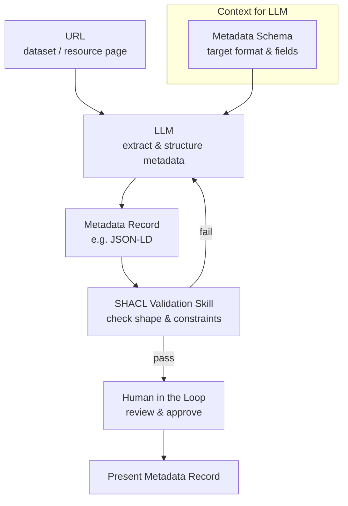
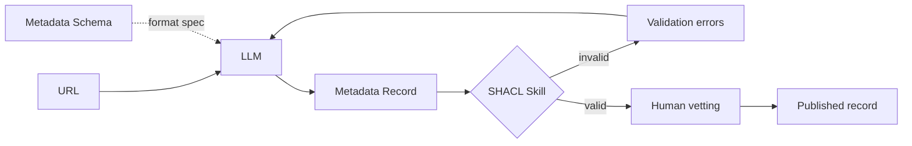

# Workflow Thoughts

A simple pipeline from URL to metadata record, with schema-guided LLM extraction, SHACL validation, and human vetting.

Makes for a good skill or, perhaps less so, multi-agent test.

## Vertical flow

**Flow in short:**

1. **URL** — source page or landing URL to extract from
2. **Metadata Schema** — feeds the LLM so the record matches the expected structure (Blueprint / schema.org fields)
3. **LLM** — produces a draft **Metadata Record**
4. **SHACL skill** — validates the record against shapes and constraints
5. **On fail** — loop back to the LLM (often with validation errors as feedback)
6. **On pass** — **human in the loop** vets the record before it's presented

## Horizontal flow (with explicit retry feedback)

