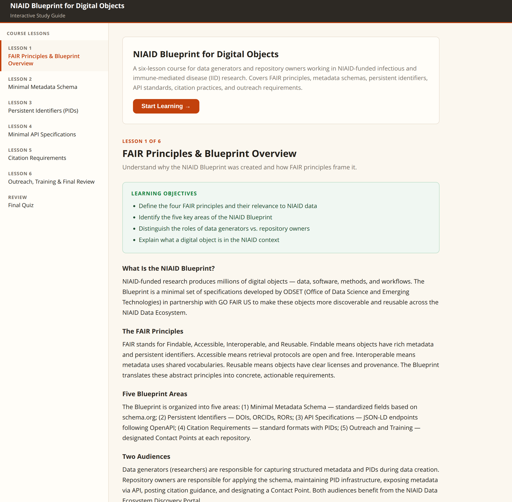

# Generated Lesson

## Notes

> This is just a proof of concept for us to discuss.

So DAIR.AI Academy released some plugins/skills for generating lessons from 
documents.  See https://github.com/dair-ai/dair-academy-plugins.

So, after installing them,  I used the [lesson-generator](https://github.com/dair-ai/dair-academy-plugins/tree/main/plugins/lesson-generator) and tried this:
> using the file @docs/NIAID_Blueprint_v2_26Sep2025_forExternal.md create
>  an interactive study guide using the lesson-generator

## Running

This is just a web site, so you can view it via any web server.  
For testing, if you have python installed, you can just run the following
command in the lessons directory:

```bash
python -m http.server 8000
```

Run this in the lessons directory and then load http://localhost:8000 in your browser.  

You should see something like:



## References

* https://github.com/dair-ai/dair-academy-plugins
